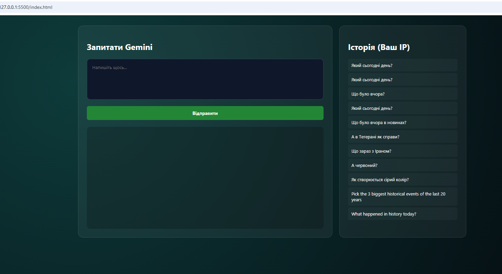

AI Bridge 🌉 — A FastAPI-powered AI interface
This is my project where I connected a modern Python backend with Google Gemini AI. It wasn't just about "making a chat" — it was about building a proper architecture with a database, async requests, and proper data validation.

And yes, I "vibecoded" the frontend part to make it look decent! ✨
### Interface Preview

🚀 The Story Behind
I wanted to build something that feels like a real product. The main challenge was to handle external API limits and make sure the data (prompts and answers) is stored safely. I chose FastAPI for its speed and SQLAlchemy 2.0 because I wanted to practice the latest industry standards.

🛠 What's Under the Hood?
Backend: Python 3.13 + FastAPI (Async all the way!).

AI Service: Google Gemini (using the latest google-genai SDK).

Database: SQLite managed by SQLAlchemy 2.0 (Models, Sessions, Migrations-ready).

Modern Tooling: Managed entirely via uv (no more slow pip installs).

Validation: Pydantic models to ensure the backend never chokes on bad data.

Frontend: Clean HTML/CSS/JS with a dark-mode vibe 🌑.

🧠 Key Learning Moments
Security First: I learned the hard way never to hardcode API keys. Now everything is tucked away in .env.

Async/Await: Handling AI responses without blocking the rest of the app.

Rate Limiting: Managed how to handle 429 Resource Exhausted errors gracefully.

⚙️ Setup & Installation
I used uv for this project because it's lightning fast. If you don't have it, you should!
1.  **Clone the repo:**
    ```bash
    git clone <your-repository-url>
    cd ai-bridge
    ```

2.  **Configure Secrets:**
    Create a `.env` file in the root folder and add your key:
    ```text
    GEMINI_API_KEY=your_actual_key_here
    ```

3.  **Run the app:**
    ```bash
    uv run uvicorn main:app --reload
    ```

## 📚 API Documentation
One of the coolest things about FastAPI is the automatic documentation. Once the server is live, check out the Swagger UI at:
`http://127.0.0.1:8000/docs`

---
*Developed with focus on Backend Engineering and clean code.*
